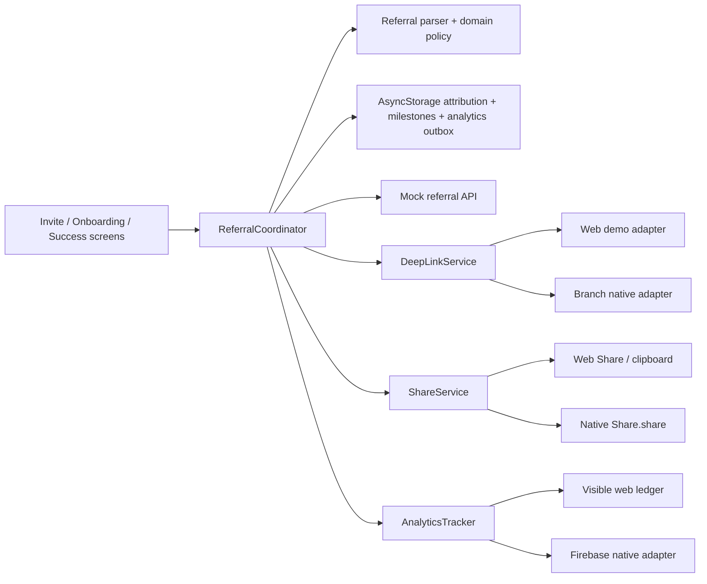
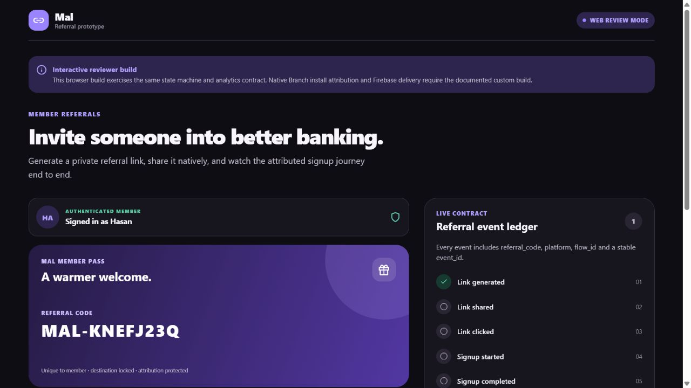
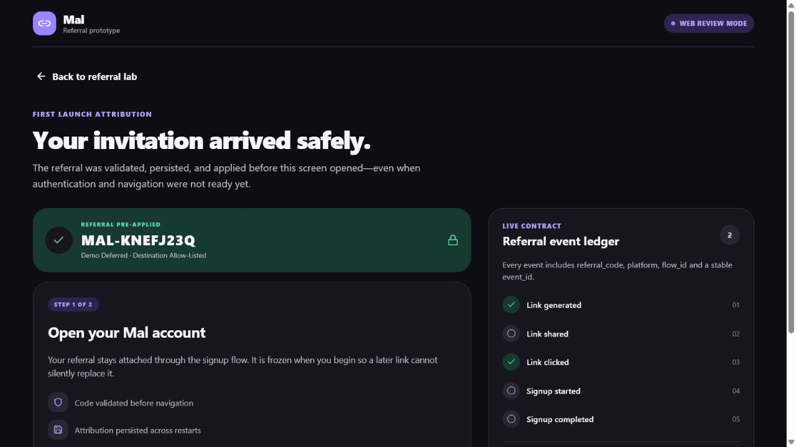
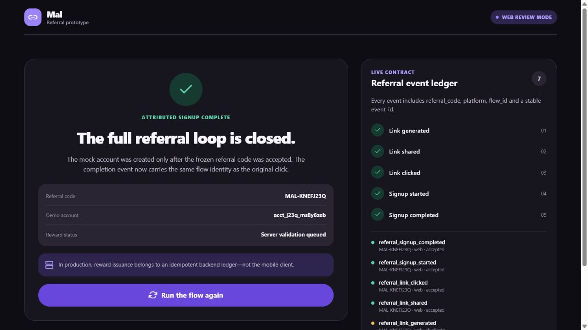
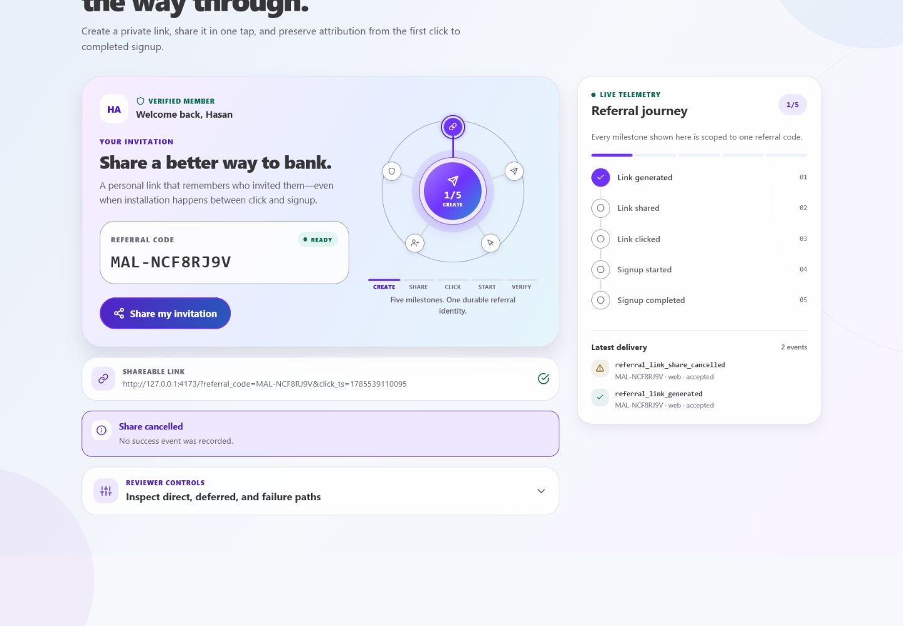
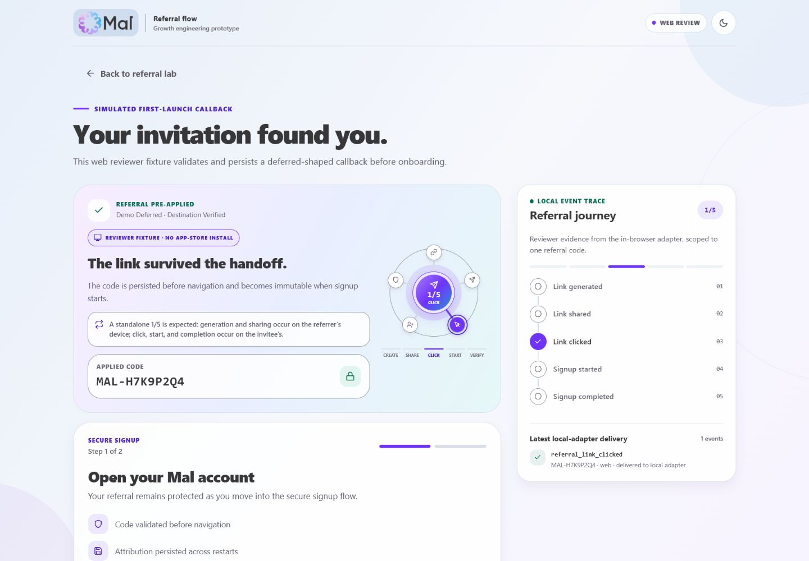
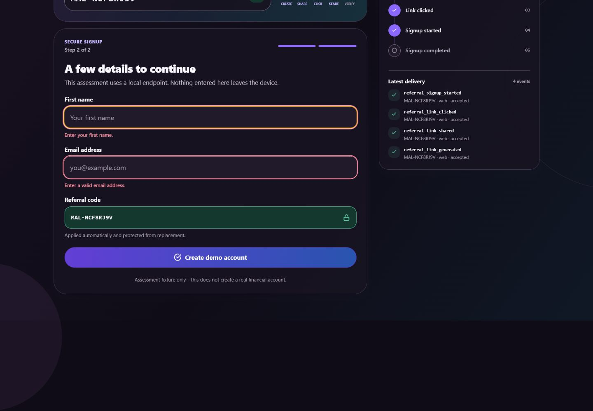
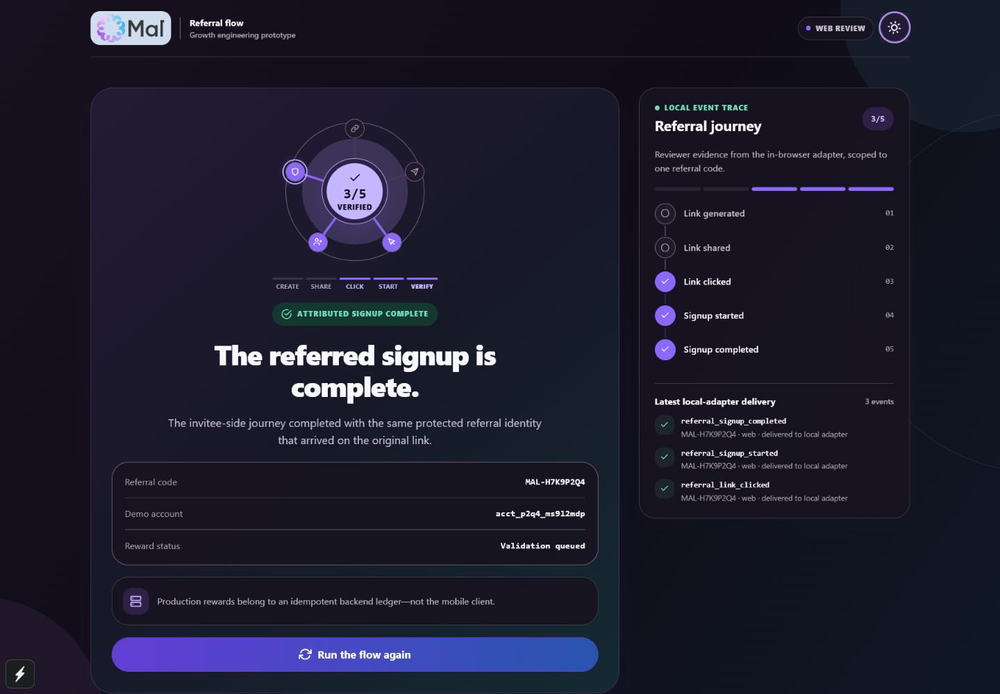
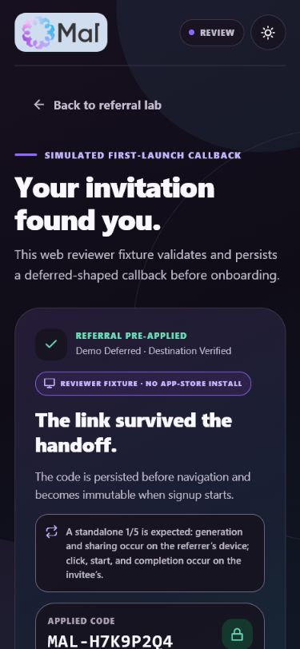

# Mal Referral Flow

A production-shaped React Native prototype for generating, sharing, resolving, and measuring member referrals.

The project has two deliberately separate execution modes:

- **Credential-free web reviewer build:** exercises the complete referral state machine, validation, routing, persistence, failure handling, and analytics contract without external accounts.
- **Custom native build configuration:** generates the real Branch/React Native Firebase native structure, packages cold-start and NativeLink runtime settings, and compiles an Android debug binary in CI with non-networked test fixtures. No provider-backed device or store run is claimed without real account credentials.

The web build is useful, interactive evidence of application behavior. It is **not** presented as proof of Android App Links, iOS Universal Links, or a store-to-install-to-first-launch handoff. Those claims require the native test matrix documented below.

For the detailed design and reliability analysis, see [docs/ARCHITECTURE.md](docs/ARCHITECTURE.md). For exact physical-device and store evidence steps, see [docs/NATIVE_PROOF_RUNBOOK.md](docs/NATIVE_PROOF_RUNBOOK.md).

## Submission links

> [!NOTE]
> The public web build is anonymous and was smoke-tested from a fresh browser tab after deployment. Native/store proof remains intentionally separate from the browser simulation.

| Deliverable | Public URL |
| --- | --- |
| Live web reviewer build | [hasan-al-hussein.github.io/mal-referral-flow](https://hasan-al-hussein.github.io/mal-referral-flow/) |
| Android preview APK | Not included — requires reviewer-safe Branch/Firebase test credentials |
| Screen-recorded native walkthrough | Not supplied — the live URL is a web simulator, not native proof |
| GitHub repository | [github.com/Hasan-Al-Hussein/mal-referral-flow](https://github.com/Hasan-Al-Hussein/mal-referral-flow) |

## Five-minute reviewer path

The credential-free web path requires no sign-in, Branch account, Firebase project, or device installation.

1. Open the live web URL above, or run the project locally with `npm ci && npm run web`.
2. Select **Generate my referral link**. A stable code for the current demo epoch and a shareable review URL are produced; `referral_link_generated` appears in the event ledger.
3. Select **Share my invitation**. A supported browser opens Web Share; otherwise the full invite is copied. The ledger records the actual outcome rather than assuming success.
4. Select **Simulate direct callback**. The Branch-shaped payload passes through the production parser and coordinator, then opens onboarding with the referral code visible and locked.
5. Enter a name and email, then select **Create demo account**. The persisted attribution identity is frozen when signup starts and completion is emitted only after the mock endpoint accepts it.
6. Select **Run the flow again**. The app clears persisted and visible journey state, remounts a fresh Invite screen at `0/5`, and restores **Generate my referral link**. Generate, share, then open **Reviewer controls** and select **Simulate deferred callback**; onboarding should open at `3/5` and completion should reach `5/5` for that combined reviewer journey. To inspect the invitee device in isolation, reset once more and select **Simulate deferred callback** without generating or sharing first; onboarding truthfully begins at `1/5 · Click` because the first two milestones occurred on the referrer's device. Both paths use `+is_first_session=true` and are labeled `demo-deferred`.
7. Select **Invalid payload** to verify safe rejection and the failure events without unintended navigation.

Useful edge-case checks:

- Enter an email containing `+fail` (for example, `review+fail@example.com`) to exercise `referral_signup_failed` while preserving the pending referral for retry.
- Open the exact same generated review URL twice to exercise the durable attribution fingerprint and duplicate-suppression path.
- Dismiss a supported share sheet to verify that cancellation is not counted as `referral_link_shared`.

## Feature checklist

### Implemented in this repository

- [x] Mock authenticated-member referral screen
- [x] Stable per-member referral code persisted within an ordinary restartable demo epoch
- [x] Cryptographically random, human-readable `MAL-XXXXXXXX` demo-code generation
- [x] Concurrent per-member generation coalescing and corrupt-code/URL rejection
- [x] Real Branch Universal Object and `generateShortUrl()` call shape in the native adapter
- [x] Native `Share.share()` integration with shared, cancelled, and failed outcomes
- [x] Branch subscription for cached initial opens and later direct-link opens
- [x] Branch cold-start initialization deferral and iOS NativeLink pasteboard configuration packaged by a custom Expo plugin
- [x] Generated referral links explicitly enable iOS NativeLink
- [x] Direct and deferred attribution through one strict parser/coordinator path
- [x] Referral code pre-applied and locked during referred onboarding
- [x] Pending attribution persisted before analytics or navigation
- [x] Full originating attribution identity (code, SHA-256-derived 128-bit fingerprint, timestamp) frozen once signup begins
- [x] Durable callback and funnel-milestone deduplication
- [x] Serialized callback/signup transitions and validated 30-day pending-attribution recovery
- [x] All five required funnel events with referral code and platform context
- [x] Durable analytics outbox with collision-resistant 128-bit event IDs that remain stable for one retry record
- [x] Explicit generation, share, deep-link, code, signup, and duplicate diagnostics
- [x] Firebase Analytics modular API in the native adapter
- [x] Firebase-compatible native parameter encoding for optional boolean attribution diagnostics
- [x] Visible credential-free event ledger for reviewer verification
- [x] Responsive web/native UI with light and dark appearance support
- [x] Mal-inspired five-stage referral orbit tied to accepted analytics milestones
- [x] Finite, state-driven motion with OS/browser reduced-motion support
- [x] Customer-first mobile layout with reviewer mechanics progressively disclosed
- [x] Mock signup acceptance and deterministic `+fail` rejection fixture
- [x] Stable mock signup idempotency keys and persisted non-PII acceptance receipts
- [x] Atomic mock receipt creation across API instances and canonical case/whitespace handling
- [x] Durable reset epochs with serialized pointer publication, stale-writer repair, and retired-namespace cleanup
- [x] Legacy unscoped-state migration and canonical physical cleanup of malformed local records
- [x] Retained accepted-outcome recovery from backend receipt through analytics, cleanup, and navigation cuts
- [x] Persisted, journey-scoped accepted-milestone hydration after a cold restart
- [x] CI entry points for type checking, linting, tests, web export, Android/iOS generated-native inspection, and Android debug compilation

### External proof/configuration still required

- [x] Publish and smoke-test an anonymous reviewer URL
- [ ] Connect a Branch test app controlled by the applicant/reviewer, including link domains, store fallbacks, and signing identities
- [ ] Connect Android/iOS Firebase apps controlled by the applicant/reviewer and verify events in DebugView
- [ ] Validate Android App Links and iOS Universal Links on physical devices
- [ ] Record a real store-mediated deferred install through Play internal testing/TestFlight
- [ ] Replace mock identity, referral API, signup, eligibility, and rewards with authoritative backend services

## Experience design

The interface is a brand-inspired assessment prototype, not a claim to be Mal's production UI. It uses the supplied Mal lockup and the public product's pale-blue, charcoal, violet, lilac, and cyan visual language while keeping the referral task—not the engineering controls—as the primary experience.

The signature **Mal Trust Loop** is a five-node orbit mapped directly to the required funnel events. Each node reflects the actual accepted event name rather than inferring a prefix from a count, so a standalone deferred callback correctly illuminates only Click at `1/5`. The local event trace remains visible for reviewers on wide screens and collapses behind an explicit control on phones.

Motion is finite and functional: entry reveals, hover/focus/press feedback, referral-code readiness, reviewer disclosure, signup progress, validation, local-trace changes, link handoff, and completion confirmation. Web controls use a shared 180ms hover language with bounded lift or directional movement, tint, glow, and icon response; primary CTAs add one finite light sweep. Static surfaces remain stable so motion never implies a false action. Animations use opacity and transforms, stop on cleanup, never delay analytics or navigation, and become immediately static when reduced motion is enabled. The light-first interface also includes a deliberate dark theme rather than relying on a generic system inversion.

## Technology choices

### Expo SDK 56, pinned

This project intentionally pins the Expo/React Native dependency set instead of floating on `latest`:

| Package | Version |
| --- | --- |
| Expo | `~56.0.18` |
| React Native | `0.85.3` |
| React | `19.2.3` |
| `react-native-branch` | `6.10.0` |
| Branch Expo config plugin | `13.0.1` |
| React Native Firebase App/Analytics | `26.0.0` |

`package-lock.json` makes the assessment reproducible, while the tilde on Expo accepts compatible SDK 56 patches. CI pins Node `24.13.0` and npm `11.6.2`, matching the verified local toolchain.

Expo provides one TypeScript codebase, a deployable React Native Web artifact, and custom native builds through Prebuild/EAS. This is deliberately **not an Expo Go solution**: Expo Go cannot load the Branch and React Native Firebase native modules or carry this app's associated-domain and intent-filter configuration. Use a development, preview, or production custom build for native verification.

References:

- [Expo development builds](https://docs.expo.dev/develop/development-builds/introduction/)
- [Expo Go and development-build limitations](https://docs.expo.dev/develop/development-builds/faq/)
- [Branch's Expo integration guide](https://help.branch.io/developer-hub/docs/react-native-expo-integration)

### Branch instead of Firebase Dynamic Links

Firebase Dynamic Links was shut down on August 25, 2025 and cannot support a new 2026 implementation. Branch remains a viable provider for link generation, direct linking, deferred attribution, and one subscription surface for cold-start and warm opens.

The native service calls the real Branch APIs:

```ts
const buo = await branch.createBranchUniversalObject(
  `referral/${referralCode}`,
  {
    title: 'Join me on Mal',
    contentDescription: 'Open a Mal account with my referral code already applied.',
    contentMetadata: {
      customMetadata: { referral_code: referralCode },
    },
  },
);

const { url } = await buo.generateShortUrl(
  {
    feature: 'referral',
    channel: 'in_app_share',
    campaign: 'member_referral',
  },
  {
    $deeplink_path: 'onboarding/referral',
    $ios_nativelink: 'true',
    referral_code: referralCode,
  },
);
```

At bootstrap, `branch.subscribe({ onOpenComplete })` forwards both the cached initial event and subsequent opens to the coordinator. The generated native projects package `deferInitForPluginRuntime` to prevent cold-start subscription races and `checkPasteboardOnInstall` for iOS NativeLink recovery. Navigation never occurs directly inside the SDK callback.

References:

- [Firebase Dynamic Links deprecation FAQ](https://firebase.google.com/support/dynamic-links-faq)
- [Branch React Native full reference](https://help.branch.io/developer-hub/docs/react-native-full-reference)

### Firebase Analytics instead of MoEngage

Firebase Analytics is a focused fit for the required five-event funnel, provides native offline batching and DebugView, and uses a small modular call surface:

```ts
await logEvent(getAnalytics(), event.name, normalizeFirebaseProperties(event));
```

The typed `AnalyticsTracker` keeps Firebase out of screens and domain logic. The native boundary encodes optional booleans as Firebase-compatible `1`/`0` parameters; required `referral_code` and `platform` remain strings. The credential-free web adapter validates the same semantic events and exposes them in the local ledger but intentionally performs no network analytics. This is a mock delivery boundary, not a claim that the browser sent native Firebase events.

Reference: [React Native Firebase Analytics](https://rnfirebase.io/analytics/usage)

## Architecture at a glance



Key boundaries:

- **Screens contain no Branch or Firebase calls.** They request operations from the coordinator and render typed state.
- **Platform files select integrations automatically.** Metro resolves `.native.ts` for Android/iOS and the unsuffixed adapter for web.
- **Link input is untrusted.** Only clicked Branch links (or explicitly marked reviewer fixtures), valid codes, and the fixed `onboarding/referral` destination are accepted.
- **Persistence precedes side effects.** A valid referral is stored before analytics and routing, so a process interruption does not silently discard it.
- **Navigation readiness is explicit.** A callback arriving before the navigation container is ready is buffered and replayed once safely routable.
- **Attribution is frozen at signup start.** A later link cannot silently replace the code during an active signup.
- **Concurrency is explicit.** Callback and signup state transitions are serialized in-process; same-milestone analytics calls coalesce before touching durable receipts.
- **Client attribution is not reward authority.** A production backend must validate eligibility, expiry, self-referral, and exactly-once reward issuance.

Primary implementation files:

- [`src/application/ReferralCoordinator.ts`](src/application/ReferralCoordinator.ts) — orchestration and reliability policy
- [`src/domain/referral.ts`](src/domain/referral.ts) — normalization, validation, routing allowlist, and fingerprints
- [`src/services/deepLinks/deepLinkService.native.ts`](src/services/deepLinks/deepLinkService.native.ts) — Branch integration
- [`src/services/deepLinks/deepLinkService.ts`](src/services/deepLinks/deepLinkService.ts) — reviewer-link adapter
- [`src/services/analytics/AnalyticsTracker.ts`](src/services/analytics/AnalyticsTracker.ts) — event contract and milestone dedupe
- [`src/services/storage/referralStorage.ts`](src/services/storage/referralStorage.ts) — epoch-scoped journey identity, analytics state, and durable receipts
- [`docs/ARCHITECTURE.md`](docs/ARCHITECTURE.md) — full reliability, rollout, privacy, and production analysis

## Credential-free web setup

Prerequisites: Node.js 22+ and npm.

```bash
npm ci
npm run web
```

No `.env` file is required. With `NATIVE_SDK_BUILD` unset or `0`, the app uses deterministic web adapters and no provider credentials.

Create and inspect a production export:

```bash
npm run build:web
npx serve dist
```

The web link adapter also accepts a review URL directly. Replace the host with the local or deployed origin:

```text
https://hasan-al-hussein.github.io/mal-referral-flow/?referral_code=MAL-H7K9P2Q4&click_ts=1774958400
https://hasan-al-hussein.github.io/mal-referral-flow/?referral_code=MAL-H7K9P2Q4&click_ts=1774958401&deferred=1
```

The second URL exercises the **deferred callback state** in the browser. It does not emulate an app-store install and is labeled accordingly in the UI and analytics as `demo-deferred`.

### Deploy the web build

The committed `vercel.json` runs `npm run build:web` and serves `dist`.

```bash
npx vercel@latest login
npx vercel@latest --prod
```

Use the assigned production domain, disable deployment protection, and verify it in an incognito window before placing it in the submission form.

## Native Branch + Firebase setup

Native mode requires a custom build. It will not work in Expo Go.

### 1. Create provider projects

In Branch test mode:

1. Register Android package and iOS bundle ID `com.hasanalhussein.malreferral`.
2. Configure the URI scheme `malreferral`.
3. Configure the primary and alternate Branch link domains.
4. Configure safe web/store fallback destinations in the Branch dashboard.
5. Add the SHA-256 fingerprint of the Android signing certificate so App Links verify.
6. Configure the Apple Team ID and associated-domain requirements for iOS.

In Firebase:

1. Create Android and iOS apps with the same identifiers.
2. Enable Google Analytics.
3. Download `google-services.json` and `GoogleService-Info.plist`.
4. Keep both files out of Git; `.gitignore` already excludes them.

### 2. Configure environment variables

Copy the documented template:

```powershell
Copy-Item .env.example .env.local
```

| Variable | Required for | Meaning |
| --- | --- | --- |
| `NATIVE_SDK_BUILD=1` | Any native provider build | Enables native config plugins and build-time settings |
| `NATIVE_BUILD_PLATFORM` | Local config/prebuild | `android`, `ios`, or `all`; EAS profiles set it per platform because `EAS_BUILD_PLATFORM` is worker-only |
| `BRANCH_ENVIRONMENT` | Branch native build | `test` for development/preview or `live` for production; profiles set this explicitly |
| `EXPO_PUBLIC_BRANCH_TEST_KEY` | Branch test build | Public `key_test_...` value passed as `testApiKey` with test mode enabled |
| `EXPO_PUBLIC_BRANCH_LIVE_KEY` | Branch live build | Public `key_live_...` value passed as required `apiKey`; optional in test mode |
| `EXPO_PUBLIC_BRANCH_KEY` | Legacy compatibility | Public alias accepted as `key_test_...` in test mode or `key_live_...` in live mode |
| `EXPO_PUBLIC_BRANCH_DOMAIN` | Branch native build | Primary Branch link host, without `https://` |
| `EXPO_PUBLIC_BRANCH_ALTERNATE_DOMAIN` | Recommended | Alternate Branch link host used by App/Universal Links |
| `GOOGLE_SERVICES_JSON` | Android Firebase build | Local path or EAS file-variable path for Android config |
| `GOOGLE_SERVICES_PLIST` | iOS Firebase build | Local path or EAS file-variable path for iOS config |
| `EAS_PROJECT_ID` | EAS services | Expo project UUID used by build/update/hosting services |

Native config validates the selected Branch environment, key prefix, and hostname-only primary/alternate domains. Test mode requires a public `key_test_...`, emits `testApiKey`, and explicitly sets `enableTestEnvironment: true`; if no live key is supplied, the test key also fills the plugin's structurally required `apiKey` slot. Live mode requires `key_live_...`, sets `enableTestEnvironment: false`, and never passes `testApiKey`. Firebase validation is platform-specific: Android needs only the JSON file and iOS needs only the plist. The referenced file must exist, parse correctly, and register `com.hasanalhussein.malreferral`; a deliberate `all` probe needs both.

Dynamic app config is evaluated in two places. Locally, `EAS_BUILD_PLATFORM` and secret EAS file variables are unavailable, so the committed build profiles set `NATIVE_BUILD_PLATFORM` per platform and config falls back to the conventional ignored files `./google-services.json` or `./GoogleService-Info.plist`. On an EAS worker, `EAS_BUILD_PLATFORM` selects the platform and the matching EAS file variable resolves to its uploaded temporary path; missing or mismatched worker credentials fail fast. Repository CI additionally performs disposable Android/iOS Prebuild inspection and compiles an Android debug binary with package-correct, non-provider test fixtures. Signing, SDK network startup, provider delivery, and physical-device behavior remain separate checks.

This follows Expo's documented [EAS environment-variable model](https://docs.expo.dev/eas/environment-variables/), including worker-provided file paths and explicit build-profile environments.

Example `.env.local` shape:

```dotenv
NATIVE_SDK_BUILD=1
NATIVE_BUILD_PLATFORM=android
BRANCH_ENVIRONMENT=test
EXPO_PUBLIC_BRANCH_TEST_KEY=key_test_REPLACE_ME
EXPO_PUBLIC_BRANCH_DOMAIN=your-app.test-app.link
EXPO_PUBLIC_BRANCH_ALTERNATE_DOMAIN=your-app-alternate.test-app.link
GOOGLE_SERVICES_JSON=./google-services.json
GOOGLE_SERVICES_PLIST=./GoogleService-Info.plist
EAS_PROJECT_ID=00000000-0000-0000-0000-000000000000
```

Branch SDK keys are public identifiers embedded in the app. Never put a Branch secret, Firebase service-account private key, keystore password, or backend credential in an `EXPO_PUBLIC_*` variable.

### 3. Build locally

After adding or changing native dependencies/configuration, regenerate native projects cleanly:

```bash
npm run native:prebuild:android
npm run native:verify:android
npm run android
```

On macOS with Xcode, use `npm run native:prebuild:ios`, `npm run native:verify:ios`, and `npm run ios`. These wrappers force provider-native mode and run config validation before generation or compilation. Windows cannot compile an iOS binary locally.

### 4. Build a shareable Android APK with EAS

The committed `development`, `preview`, and `store-test` profiles set `BRANCH_ENVIRONMENT=test`; `production` explicitly selects `live`. Preview uses internal distribution and produces an APK. Store-test reuses the EAS `preview` credentials but produces store artifacts with test attribution and remote auto-incremented versions.

```bash
npx eas-cli@21.4.0 login
npx eas-cli@21.4.0 init
```

The committed profile selects the EAS `preview` environment. Store the public Branch values and the Android Firebase file there:

```powershell
npx eas-cli@21.4.0 env:set preview --name EXPO_PUBLIC_BRANCH_TEST_KEY --value key_test_REPLACE_ME --type string --visibility plaintext
npx eas-cli@21.4.0 env:set preview --name EXPO_PUBLIC_BRANCH_DOMAIN --value your-app.test-app.link --type string --visibility plaintext
npx eas-cli@21.4.0 env:set preview --name EXPO_PUBLIC_BRANCH_ALTERNATE_DOMAIN --value your-app-alternate.test-app.link --type string --visibility plaintext
npx eas-cli@21.4.0 env:set preview --name GOOGLE_SERVICES_JSON --value .\google-services.json --type file --visibility secret
npx eas-cli@21.4.0 env:set preview --name EAS_PROJECT_ID --value YOUR_EXPO_PROJECT_UUID --type string --visibility plaintext
```

For production, configure `EXPO_PUBLIC_BRANCH_LIVE_KEY=key_live_...` in the EAS `production` environment. For an iOS build, upload `GOOGLE_SERVICES_PLIST` to the selected environment instead. EAS injects a temporary worker path into the environment variable; do not expect a secret file variable to be readable during a local `expo config` command. The local ignored-file fallback exists for that evaluation path. Development, preview, and production select their same-named environments; store-test intentionally selects `preview` so test keys are used in Play internal testing/TestFlight.

Build:

```bash
npx eas-cli@21.4.0 build --platform android --profile preview
```

Keep unauthenticated access to internal builds enabled, test the resulting URL in incognito, and add the final APK URL to the submission table. Obtain the EAS signing-certificate SHA-256 with `npx eas-cli@21.4.0 credentials --platform android` plus `keytool`, then add it to Branch before claiming verified App Links. For the app-absent → store → first-launch proof, build `--profile store-test` and follow [the native proof runbook](docs/NATIVE_PROOF_RUNBOOK.md).

## Direct and deferred test matrix

| Case | How to exercise | Expected result | Evidence level |
| --- | --- | --- | --- |
| Web direct fixture | Select **Simulate direct callback** or load a URL without `deferred=1` | Accepted as `demo-direct`; onboarding opens with the normalized code | Interactive now |
| Web deferred fixture | Select **Simulate deferred callback** or load a URL with `deferred=1` | Accepted as `demo-deferred`; onboarding opens with the code pre-applied | Interactive simulation, not install proof |
| Web malformed input | Select **Invalid payload** | No navigation; resolution failure and code rejection are visible | Interactive now |
| Web signup failure | Submit an email containing `+fail` | Signup remains retryable; `referral_signup_failed` is visible | Interactive now |
| Exact callback replay | Open the same URL, including `click_ts`, more than once | Fingerprint is already processed; duplicate side effects are suppressed | Application-level proof |
| Native warm open | Background a configured build and tap its Branch link | Branch callback routes to referred onboarding once | Requires configured physical device |
| Native cold open | Terminate a configured build and tap its Branch link | Cached initial callback is persisted, buffered until navigation is ready, then routed | Requires configured physical device |
| Android direct App Link | Tap configured `https://...app.link/...` with APK installed | Verified App Link opens the app and preserves `referral_code` | Requires matching Branch domain, package, and signing SHA-256 |
| Native deferred install | Uninstall app, tap Branch link, install from Play internal testing/TestFlight, then first-launch | Branch returns the referral with `+is_first_session`; code is pre-applied | **Store-mediated test required; not proven by web or sideloaded APK** |
| Ordinary launch | Launch without a clicked Branch link | No referral route and no stale click event | Native smoke test |
| Provider failure/offline | Disable network or return an SDK error | Normal app remains usable; failure is recorded; no success milestone fabricated | Native/provider test |

For native evidence, capture the Branch Link Validator/dashboard result, Android/iOS device screen, and Firebase DebugView entry together with the tested build version. An EAS sideloaded APK is excellent direct-link evidence but is not, by itself, deterministic proof of a Play Store Install Referrer handoff.

## Analytics contract

Every required success event carries the same typed context:

| Property | Type | Purpose |
| --- | --- | --- |
| `referral_code` | string | Normalized referral identity (`MAL-XXXXXXXX`) |
| `platform` | string | `android`, `ios`, `web`, or supported runtime fallback |
| `event_id` | string | Random 128-bit ID that remains stable for retries of one outbox record |
| `flow_id` | string | Correlates the referrer or invitee journey |
| `schema_version` | `1` | Makes contract evolution explicit |
| `app_version` | string | Separates behavior by shipped app version |
| `occurred_at_utc` | ISO-8601 string | Client-side occurrence timestamp in UTC |
| `attribution_kind` | optional string | `direct`, `deferred`, `demo-direct`, or `demo-deferred` |
| `is_first_session` | optional boolean (`1`/`0` in Firebase transport) | Mirrors deferred first-session context |
| `match_guaranteed` | optional boolean (`1`/`0` in Firebase transport) | Preserves Branch match certainty for platform-aware analysis; never authorizes rewards |
| `share_channel` | optional string | Native share, Web Share, or clipboard fallback |
| `reason` | optional string | Allowlisted bounded diagnostic reason; never form data or credentials |

### Required funnel events

| Event | Emitted when |
| --- | --- |
| `referral_link_generated` | A stable code and usable Branch/reviewer URL have both resolved |
| `referral_link_shared` | The platform share operation reports a successful handoff |
| `referral_link_clicked` | A valid, non-duplicate attribution callback is persisted and accepted |
| `referral_signup_started` | Referred onboarding starts and its persisted attribution identity is frozen |
| `referral_signup_completed` | The mock account and referral acceptance both succeed |

All five success events require a real, non-empty referral code plus platform context. Screen remounts and callback replays cannot re-emit a completed milestone for the same flow.

### Failure and diagnostic events

- `referral_link_generation_failed`
- `referral_link_share_cancelled`
- `referral_link_share_failed`
- `referral_deeplink_resolution_failed`
- `referral_code_rejected`
- `referral_signup_failed`
- `referral_state_cleanup_failed`
- `referral_duplicate_suppressed`

Failure events include the referral code when it has passed strict validation and a bounded allowlisted `reason`. A failure before code creation uses `UNAVAILABLE`; malformed untrusted input uses `INVALID`, so raw URLs, email-like strings, provider errors, and form data do not become analytics parameters.

Firebase provides queued delivery, not end-to-end exactly once. Before a once-only success event is handed to the adapter, this app writes the validated event to a bounded local outbox. Adapter rejection leaves it available for startup retry with the same `event_id`; accepted milestones suppress concurrent/replayed application calls. A crash between provider acceptance and the local receipt can still cause redelivery, so a production warehouse must deduplicate by `event_id`.

## Verification

Run the full repository gate:

```bash
npm run check
npm run build:web
```

Equivalent individual commands:

```bash
npm run typecheck
npm run lint
npm test
npm run build:web
```

GitHub Actions runs those checks plus clean Android/iOS Prebuild inspection and an Android debug compilation on pushes to `main` and on pull requests. Provider-runtime and store-install verification remain separate because they require configured accounts, signing identities, physical devices, and store/install state.

The rendered reviewer build was checked at 375 x 812, 768 x 1024, 812 x 375, 1440 x 1000, and a 720px CSS viewport as a 1440-at-200%-zoom reflow proxy, in light and dark themes. The combined Generate → Share → Deferred path was verified at `3/5` on onboarding and `5/5` on completion. A standalone deferred fixture was separately verified at `1/5 · Click`; signup start and completion advance that invitee-side trace to `3/5 · Verified`. **Run the flow again** was regression-checked to restore a new Invite route at `0/5` without the previous referral code. Reset creates a fresh demo storage epoch, including a newly generated local code. The reduced-motion branches were source-verified for immediate state values and disabled navigation animation; final OS/browser-setting emulation remains a manual device check.

## Known limitations and proof boundary

- **Web deferred linking is a labeled fixture.** It proves parser, persistence, routing, signup, and analytics behavior after a deferred-shaped callback; it cannot prove OS or app-store attribution.
- **No provider credentials are committed.** A reviewer can run the web flow immediately. Branch URL serving and Firebase delivery require their own configured projects.
- **The backend is local.** The mock produces a random 40-bit human-readable code and preserves it per fixture member, but it does not enforce global uniqueness. Expiry, campaign status, recipient eligibility, self-referral prevention, fraud controls, account authority, and rewards require a server.
- **Authentication is a fixture.** The referrer identity is fixed and recipient onboarding assumes an unauthenticated user. A production app must gate routing on real auth hydration and reject already-authenticated/ineligible recipients server-side.
- **Reset starts a new demo epoch.** Reset rotates every persisted demo namespace before asynchronous cleanup, including the generated code, pending/frozen attribution, callback and analytics receipts, outbox items, mock signup receipts, buffered routing, and visible telemetry. The next journey therefore generates a fresh code and starts at `0/5`.
- **A share success is not a delivery receipt.** It means the platform accepted the share action. Android cannot reliably confirm that a recipient received it.
- **A sideloaded APK is not store-mediated deferred proof.** Deterministic install-referrer validation requires a real Play/TestFlight path and configured provider dashboards.
- **Deferred matching may be uncertain.** `+is_first_session` is routing context, not financial authorization. Production UX needs a confirmation/manual-code recovery path.
- **The Branch Expo plugin is community-maintained.** Versions are locked; generated manifests, entitlements, AASA, and `assetlinks.json` must be inspected on upgrades.
- **Analytics cannot authorize rewards.** Firebase is observability, not the financial source of truth. Reward acceptance belongs in a transactional, idempotent backend ledger.
- **iOS distribution has external constraints.** Windows cannot build iOS locally; ad-hoc installation needs registered devices and store testing requires Apple credentials.

## Screenshots

### Referral generation and inspectable analytics



### Deferred first-launch fixture with the code pre-applied



### Completed five-event funnel



### Trust Loop motion and state QA











Native share-sheet and real Branch dashboard evidence are intentionally not shown without a credentialed native build; the exact verification procedure is documented above.

---

This assessment optimizes for a reviewer-visible prototype without hiding the production boundary: application behavior is demonstrable without credentials, native integrations use the real SDK call shapes, and the remaining store/provider evidence is named precisely rather than implied.
